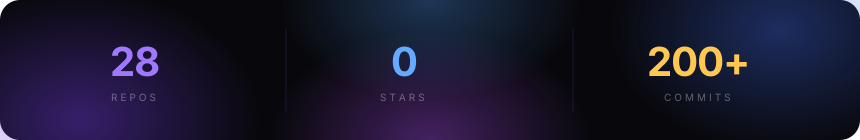

***

## 🚀 Featured Projects

| Project | Description | Stack | Link |
|---------|-------------|-------|------|
| **RAG Systems Eval Suite** | Benchmarked 7 RAG strategies across 3,500 pairs. Advanced RAG achieved 0.881 faithfulness. Dual-provider LLM-as-judge with checkpoint/resume. | Python · FAISS · LangChain · Groq · Streamlit | [GitHub](https://github.com/Adityax-07) |
| **CodeSage** | Fine-tuned Qwen2.5-1.5B with LoRA to 85.3% accuracy at $0.0002/query — outperforming RAG and baseline LLM across all quality metrics. | Python · HuggingFace PEFT · LoRA · Groq · Streamlit | [GitHub](https://github.com/Adityax-07) |
| **Autonomous MLOps Agent** | UPI fraud detection agent using LangGraph + XGBoost. Reduced incident response from days to <60 seconds. ROC-AUC 0.99 post-retrain. | FastAPI · XGBoost · LangGraph · Evidently AI · MLflow · Docker | [GitHub](https://github.com/Adityax-07) |

***

## 🏆 Highlights

* Benchmarked **7 RAG strategies** across **3,500 evaluation pairs** — Advanced RAG at 0.881 faithfulness
* Fine-tuned **Qwen2.5-1.5B** → **85.3% accuracy** at **$0.0002/query** using LoRA
* MLOps agent reducing incident response from **days → <60 seconds**, zero human intervention
* **Oracle Generative AI Professional** & **Oracle AI Vector Search Professional** certified
* B.Tech IT, MAIT GGSIPU — CGPA **8.0**

***

## 🐍 Contribution Graph

  <picture>
    <source media="(prefers-color-scheme: dark)" srcset="https://raw.githubusercontent.com/Adityax-07/Adityax-07/output/github-snake-dark.svg"/>
    <source media="(prefers-color-scheme: light)" srcset="https://raw.githubusercontent.com/Adityax-07/Adityax-07/output/github-snake.svg"/>
    
  </picture>

***

  powered by <a href="https://github.com/collectioneur/readme-aura">readme-aura</a>

